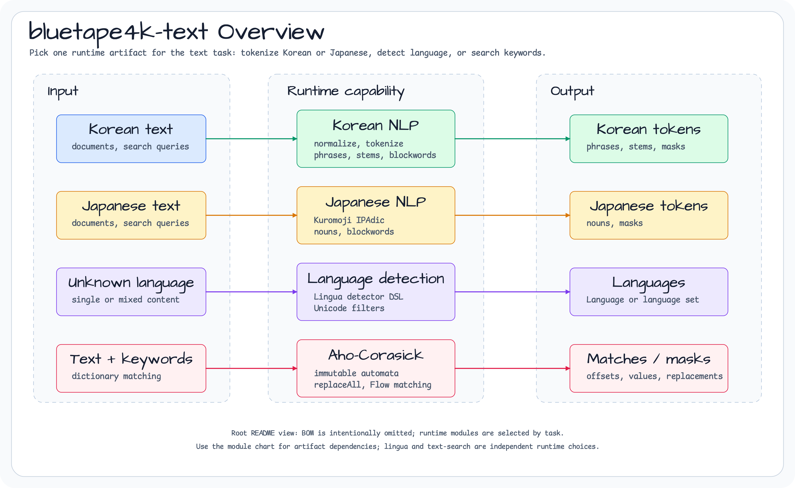
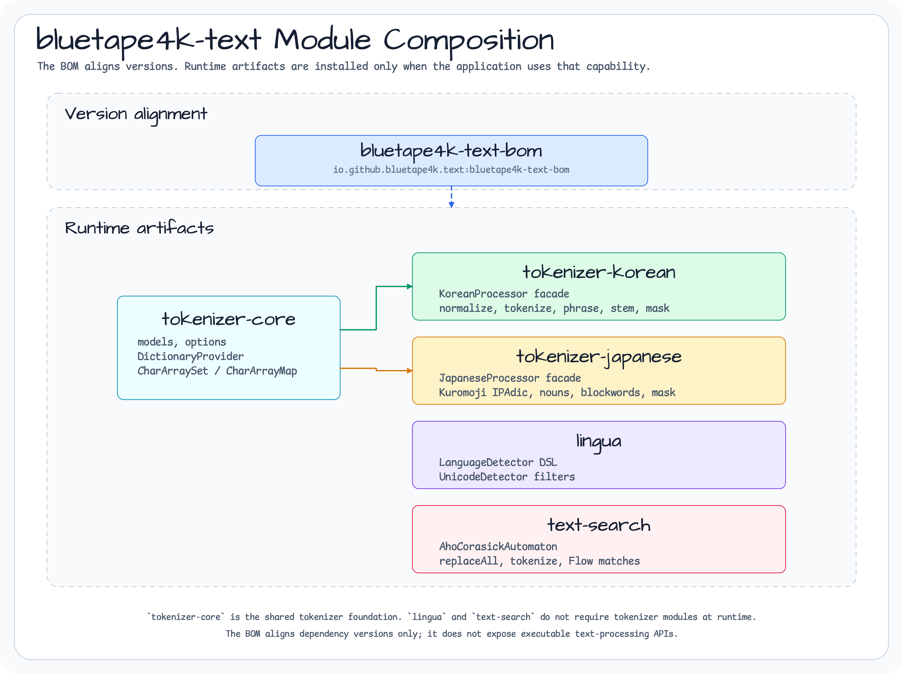
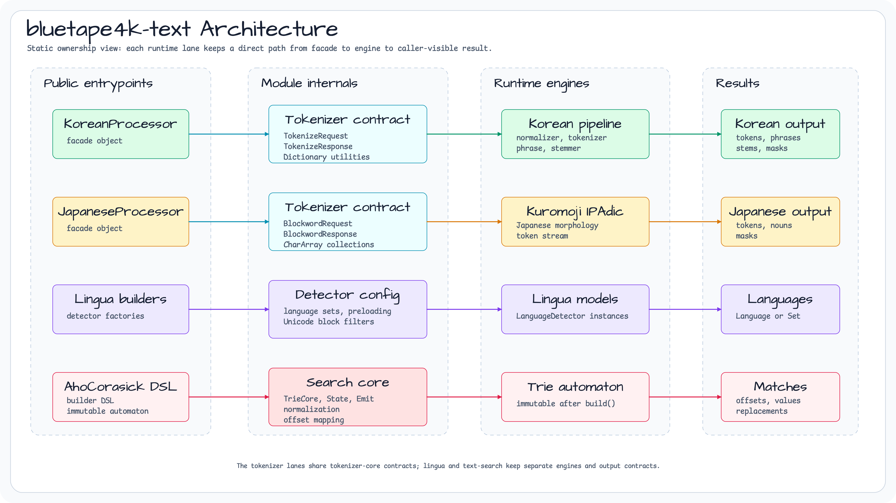

# bluetape4k-text

[](https://github.com/bluetape4k/bluetape4k-text/actions/workflows/ci.yml)
[](https://central.sonatype.com/namespace/io.github.bluetape4k.text)
[](https://kotlinlang.org)
[](https://openjdk.org)
[](LICENSE)

[English](./README.md) | 한국어


Kotlin/JVM 텍스트 처리 라이브러리 — 한국어·일본어 형태소 분석기, 다국어 언어 감지, Aho-Corasick 다중 키워드 검색 — bluetape4k 에코시스템의 일부입니다.

## 프로젝트 목적

`bluetape4k-text`는 Kotlin 서비스에서 한국어/일본어 토큰화, 언어 감지, 사전 기반 필터링,
고성능 키워드 검색을 재사용 가능한 텍스트 처리 primitive로 제공합니다.

## 제공 기능

- **Tokenizer core** — 공통 request/response 모델, dictionary 유틸리티, severity metadata, `CharArraySet`
- **한국어 NLP** — 정규화, POS tokenization, 구 추출, 어간 추출, 문장 분리, runtime dictionary 확장, 금칙어 마스킹
- **일본어 NLP** — Kuromoji IPAdic tokenization, POS helper, 명사 필터링, 금칙어 마스킹
- **언어 감지** — Lingua 기반 detector factory와 혼합 언어 감지 helper
- **Aho-Corasick 검색** — 불변 automaton, DSL builder, replacement, word boundary, Kotlin Flow matching

<!-- README_VISUAL_OVERVIEW:START -->
## Overview Diagram



## Module Composition Chart


<!-- README_VISUAL_OVERVIEW:END -->

## 모듈

| 모듈 | 설명 | 아티팩트 |
|---|---|---|
| `bom` | 텍스트 아티팩트 버전 정렬용 소비자 BOM | `io.github.bluetape4k.text:bluetape4k-text-bom` |
| `tokenizer-core` | 공통 도메인 모델 (`TokenizeRequest/Response`, `BlockwordRequest/Response`, `Severity`), 사전 유틸리티 (`DictionaryProvider`, `CharArraySet`) | `io.github.bluetape4k.text:tokenizer-core` |
| `lingua` | Lingua 기반 Kotlin DSL — `LanguageDetector` 팩토리, 혼합 언어 감지 (`Set<Language>`), `UnicodeDetector` | `io.github.bluetape4k.text:lingua` |
| `text-search` | `AhoCorasickAutomaton<V>` — O(n+m+z) 다중 키워드 검색, 유니코드 정규화, 단어 경계, Kotlin Flow API | `io.github.bluetape4k.text:text-search` |
| `tokenizer-japanese` | Kuromoji IPAdic 기반 `JapaneseProcessor` 파사드 — 형태소 분석, POS 필터링, 금칙어 감지·마스킹 | `io.github.bluetape4k.text:tokenizer-japanese` |
| `tokenizer-korean` | `KoreanProcessor` 파사드 — 한국어 전처리 전 파이프라인: 정규화, 형태소 분석, 구 추출, 어간 추출, 문장 분리, 금칙어 마스킹 | `io.github.bluetape4k.text:tokenizer-korean` |

## 품질 근거

0.2.1 품질 게이트는 저장소에 포함되어 있고 재현 가능합니다:

| 근거 | 링크 |
|---|---|
| 텍스트 품질 게이트와 fixture corpus | [spec](docs/superpowers/specs/2026-05-27-issue-83-text-quality-benchmark-spec.md) |
| 사전 및 금칙어 업데이트 파이프라인 | [plan](docs/superpowers/plans/2026-05-27-issue-85-dictionary-update-pipeline-plan.md) |
| 토크나이저와 언어 감지 품질 리포트 | [report](docs/superpowers/research/2026-05-27-issue-86-quality-report.md) |

이 리포트는 한국어/일본어 혼합 텍스트 토큰화, Lingua 언어 감지, 안전한 요청 경계 실패를
결정적 테스트로 검증합니다. 대규모 통계 NLP 벤치마크 주장이 아니라 릴리스 준비 상태를
확인하는 품질 게이트입니다.

## 아키텍처



## 설치

각 모듈을 개별적으로 추가합니다:

```kotlin
// build.gradle.kts
val textVersion = "<current release or snapshot>"

// 한국어 NLP
implementation("io.github.bluetape4k.text:tokenizer-korean:$textVersion")

// 일본어 NLP
implementation("io.github.bluetape4k.text:tokenizer-japanese:$textVersion")

// 언어 감지
implementation("io.github.bluetape4k.text:lingua:$textVersion")

// Aho-Corasick 검색
implementation("io.github.bluetape4k.text:text-search:$textVersion")

// 공통 모델만 필요한 경우 (커스텀 토크나이저 구현 시)
implementation("io.github.bluetape4k.text:tokenizer-core:$textVersion")
```

SNAPSHOT 버전 사용 시 Maven Central Snapshots 저장소를 추가하세요:

```kotlin
repositories {
    maven {
        url = uri("https://central.sonatype.com/repository/maven-snapshots/")
    }
}
```

## 사용법

실행 가능한 예제는 `examples/` 아래에 있으며 CI에서 함께 검증됩니다:

- [`examples/text-search-examples`](examples/text-search-examples): builder,
  DSL, replacement, `matchesAsFlow(...).take(1)` 시나리오
- [`examples/lingua-examples`](examples/lingua-examples): detector 재사용,
  언어 subset, low-accuracy mode, 혼합 언어 텍스트
- [`examples/tokenizer-safety-examples`](examples/tokenizer-safety-examples):
  tokenizer/blockword 입력을 웹 서비스 경계에서 처리하는 예제

### 한국어 토크나이저

```kotlin
import io.bluetape4k.tokenizer.korean.KoreanProcessor
import io.bluetape4k.tokenizer.model.BlockwordRequest
import io.bluetape4k.tokenizer.model.Severity

// 1. 구어체 텍스트 정규화
val normalized = KoreanProcessor.normalize("안됔ㅋㅋㅋㅋㅋ")
// → "안돼ㅋㅋㅋ"

// 2. 형태소 분석
val tokens = KoreanProcessor.tokenize("주말특가 쇼핑몰")
KoreanProcessor.tokensToStrings(tokens)
// ["주말", "특가", "쇼핑몰"]

// 3. 어간 추출
val stemmed = KoreanProcessor.stem(KoreanProcessor.tokenize("가느다란"))
println(stemmed.first().stem)  // → "갈다"

// 4. 구 추출
val phrases = KoreanProcessor.extractPhrases(
    KoreanProcessor.tokenize("성탄절 쇼핑"),
    filterSpam = false
)

// 5. 문장 분리
val sentences = KoreanProcessor.splitSentences("안녕? 세상아?").toList()
// size == 2

// 6. 런타임 명사 사전 추가
KoreanProcessor.addNounsToDictionary("블루테이프4K", "주말특가")

// 7. 금칙어 마스킹
KoreanProcessor.addBlockwords(listOf("욕설"), Severity.HIGH)
val response = KoreanProcessor.maskBlockwords(BlockwordRequest("이 욕설은 나쁜 말이야"))
// response.maskedText → "이 **은 나쁜 말이야"
```

### 일본어 토크나이저

```kotlin
import io.bluetape4k.tokenizer.japanese.JapaneseProcessor
import io.bluetape4k.tokenizer.model.blockwordRequestOf

// 형태소 분석
val tokens = JapaneseProcessor.tokenize("お寿司が食べたい。")
val surfaces = tokens.map { it.surface }
// [お, 寿司, が, 食べ, たい, 。]

// 명사 필터링
val nouns = JapaneseProcessor.filterNoun(
    JapaneseProcessor.tokenize("私は、日本語の勉強をしています。")
).map { it.surface }
// [私, 日本語, 勉強]

// 금칙어 마스킹
val request = blockwordRequestOf("ホモの男性を理解できない")
val result = JapaneseProcessor.maskBlockwords(request)
println(result.maskedText)       // **の男性を理解できない
println(result.blockwordExists)  // true
```

### 언어 감지

```kotlin
import com.github.pemistahl.lingua.api.Language
import io.bluetape4k.lingua.allLanguageDetector
import io.bluetape4k.lingua.detectAllLanguagesOf
import io.bluetape4k.lingua.languageDetectorOf

// 감지기 생성 (인스턴스 재사용 권장 — 모델 로딩 비용이 있음)
val detector = allLanguageDetector {
    withPreloadedLanguageModels()
    withMinimumRelativeDistance(0.0)
}

// 단일 언어 감지
val lang = detector.detectLanguageOf("Hello, world")
// Language.ENGLISH

// 혼합 언어 감지
val langs = detector.detectAllLanguagesOf("Hello 안녕 こんにちは")
// setOf(Language.ENGLISH, Language.KOREAN, Language.JAPANESE)

// 특정 언어 집합으로 감지기 생성
val koEnDetector = languageDetectorOf(
    languages = setOf(Language.ENGLISH, Language.KOREAN),
    minimumRelativeDistance = 0.0,
    isEveryLanguageModelPreloaded = true
)
```

### Aho-Corasick 텍스트 검색

```kotlin
import io.bluetape4k.text.search.AhoCorasickAutomaton
import io.bluetape4k.text.search.SearchOptions
import io.bluetape4k.text.search.WordBoundary
import io.bluetape4k.text.search.ahoCorasick
import io.bluetape4k.text.search.flow.matchesAsFlow

// 빌더 API
val automaton = AhoCorasickAutomaton.builder<String>()
    .add("apple", "APPLE")
    .add("banana", "BANANA")
    .options(SearchOptions(ignoreCase = true, allowOverlaps = false))
    .build()

val matches = automaton.parseText("I like Apple and BANANA.")
// [Match(start=7, end=11, keyword="apple", value="APPLE"), ...]

// DSL 빌더
val kw = ahoCorasick<String> {
    ignoreCase = true
    wordBoundary = WordBoundary.LATIN_ALPHA
    keyword("fun", "KW_FUN")
    keyword("val", "KW_VAL")
}

// replaceAll로 금칙어 마스킹
val blocked = AhoCorasickAutomaton.builder<String>()
    .apply { listOf("bad", "worse").forEach { add(it, "***") } }
    .build()
val clean = blocked.replaceAll("That's bad and worse!") { it.value }
// "That's *** and ***!"

// Kotlin Flow — 첫 번째 알림 수신
val firstAlert = automaton.matchesAsFlow("ERROR in disk")
    .take(1)
    .toList()
```

### 웹 서비스 입력 경계

`tokenizeRequestOf`와 `blockwordRequestOf`는 downstream 처리 전에 blank text와
`MAX_TOKENIZE_TEXT_LENGTH` / `MAX_BLOCKWORD_TEXT_LENGTH` 초과 입력을 거부합니다.
HTTP adapter는 blank 입력을 `400 Bad Request`, 너무 긴 입력을
`413 Payload Too Large`로 매핑하는 것이 좋습니다. 오류 응답에는 status, 실제
길이, 최대 길이만 담고 제출된 텍스트는 포함하지 마세요.

```kotlin
import io.bluetape4k.tokenizer.model.MAX_TOKENIZE_TEXT_LENGTH
import io.bluetape4k.tokenizer.model.tokenizeRequestOf

fun tokenizeHttp(text: String): Int =
    when {
        text.isBlank() -> 400
        text.length > MAX_TOKENIZE_TEXT_LENGTH -> 413
        else -> {
            tokenizeRequestOf(text)
            200
        }
    }
```

## 요구사항

- **JDK**: 25+
- **Kotlin**: 2.4+
- **Gradle**: 저장소에 포함된 Wrapper 기준 9.7.0

## 라이선스

MIT License — [LICENSE](LICENSE) 참조
