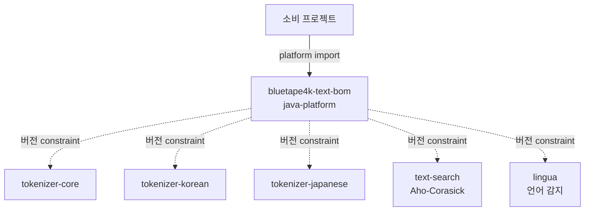

# bluetape4k-text-bom

한국어 | [English](./README.md)

**bluetape4k-text** 생태계용 Maven BOM (Bill of Materials). 모든 `io.github.bluetape4k.text:*`
모듈의 버전을 중앙 관리한다.

## Architecture



BOM은 Gradle `java-platform` 으로 `<dependencyManagement>` constraint 만 게시한다.

## 핵심 기능

- 모든 `bluetape4k-text` 모듈 버전 중앙 관리
- Tokenizer + Search + 언어 감지 스택 버전 일관성 보장
- `bluetape4k-dependencies` 가 상위에서 통합

## 관리 모듈

| 모듈 | 설명 |
|------|------|
| `bluetape4k-tokenizer-core` | Tokenizer 코어 추상화 |
| `bluetape4k-tokenizer-korean` | 한국어 형태소 분석기 |
| `bluetape4k-tokenizer-japanese` | 일본어 토크나이저 |
| `bluetape4k-text-search` | Aho-Corasick 다중 패턴 검색 |
| `bluetape4k-lingua` | 다국어 감지 |

## 사용 예제

### Gradle Kotlin DSL

```kotlin
plugins {
    id("io.spring.dependency-management") version "1.1.x"
}

dependencyManagement {
    imports {
        mavenBom("io.github.bluetape4k.text:bluetape4k-text-bom:<version>")
    }
}

dependencies {
    implementation("io.github.bluetape4k.text:bluetape4k-tokenizer-korean")
    implementation("io.github.bluetape4k.text:bluetape4k-text-search")
}
```

### 순수 Gradle

```kotlin
dependencies {
    implementation(platform("io.github.bluetape4k.text:bluetape4k-text-bom:<version>"))
    implementation("io.github.bluetape4k.text:bluetape4k-tokenizer-korean")
}
```

### Maven

```xml
<dependencyManagement>
    <dependencies>
        <dependency>
            <groupId>io.github.bluetape4k.text</groupId>
            <artifactId>bluetape4k-text-bom</artifactId>
            <version>${bluetape4k-text.version}</version>
            <type>pom</type>
            <scope>import</scope>
        </dependency>
    </dependencies>
</dependencyManagement>
```

## 설정 옵션

BOM 자체는 별도 설정이 없다. SNAPSHOT 사용 시 Sonatype Central Snapshots 저장소 추가:

```kotlin
repositories {
    mavenCentral()
    maven {
        name = "central-snapshots"
        url = uri("https://central.sonatype.com/repository/maven-snapshots/")
    }
}
```

## 의존성

이 BOM은 `bluetape4k-dependencies` 에서 자동 통합된다. 여러 bluetape4k 생태계를 함께 사용한다면
`io.github.bluetape4k:bluetape4k-dependencies` import 권장.
