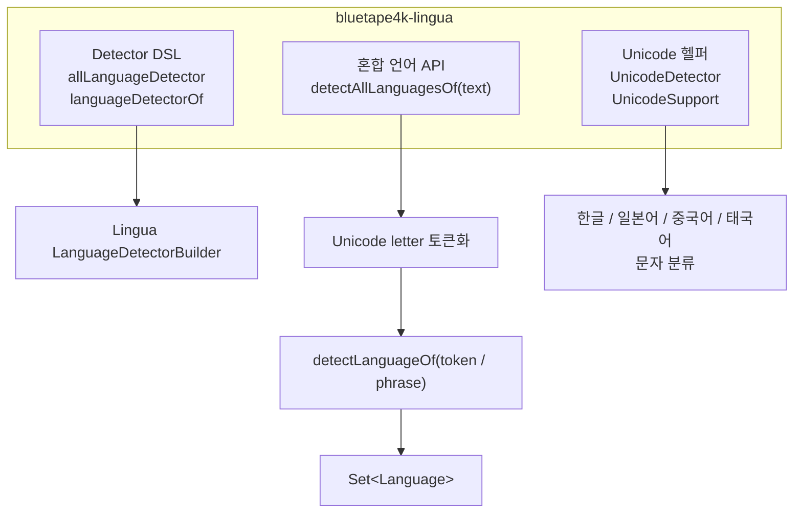
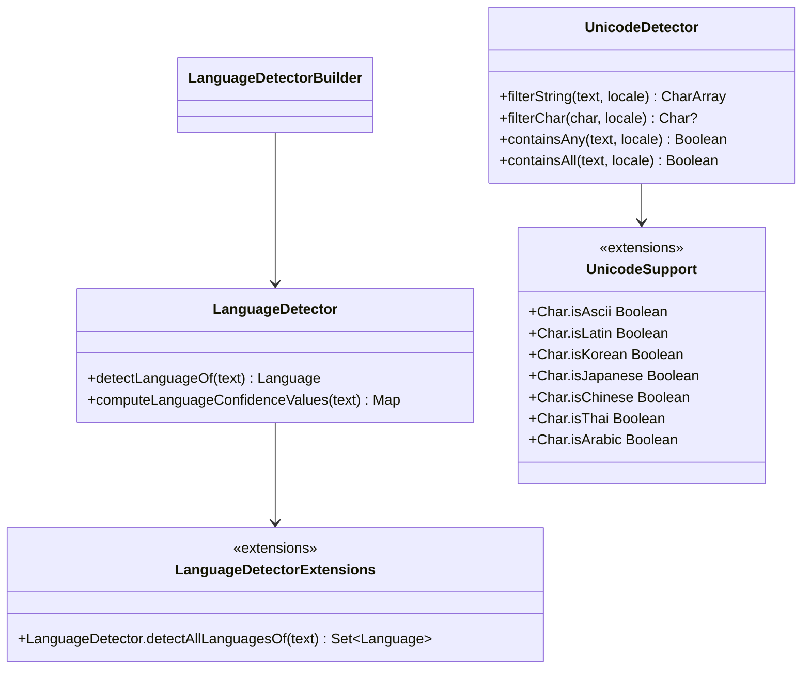

한국어 | [English](./README.md)

# bluetape4k-lingua

`com.github.pemistahl:lingua`를 감싸는 얇은 Kotlin DSL 래퍼이며, 혼합 언어 텍스트에서 검출된 모든 언어를 `Set<Language>`로 반환하는 편의 API를 제공합니다.

## 아키텍처





## 주요 기능

- Lingua `LanguageDetector` 생성을 위한 Kotlin DSL 팩토리 함수
- `Language`, `IsoCode639_1`, `IsoCode639_3` 기반 빌더 지원
- 혼합 언어 텍스트용 `detectAllLanguagesOf(text): Set<Language>` 확장 함수
- 짧은 Latin 토큰 오탐 보정 (예: `Hello → SOTHO` 오탐 억제)
- `UnicodeDetector` — 스크립트 기반 문자 필터링 (한글, 일본어, 중국어, 태국어)
- `UnicodeSupport` — 유니코드 블록 범위별 `Char` 확장 프로퍼티

## 사용법

### Kotlin DSL로 detector 생성

```kotlin
import com.github.pemistahl.lingua.api.Language
import io.bluetape4k.lingua.allLanguageDetector

val detector = allLanguageDetector {
    withPreloadedLanguageModels()
    withMinimumRelativeDistance(0.0)
}

val language = detector.detectLanguageOf("Hello, world")
// Language.ENGLISH
```

### 혼합 언어 텍스트에서 모든 언어 검출

```kotlin
import com.github.pemistahl.lingua.api.Language
import io.bluetape4k.lingua.allLanguageDetector
import io.bluetape4k.lingua.detectAllLanguagesOf

val detector = allLanguageDetector {
    withMinimumRelativeDistance(0.0)
}

val languages = detector.detectAllLanguagesOf("Hello 안녕 こんにちは")
// setOf(Language.ENGLISH, Language.KOREAN, Language.JAPANESE)
```

### 특정 언어 집합으로 detector 생성

```kotlin
import com.github.pemistahl.lingua.api.Language
import io.bluetape4k.lingua.languageDetectorOf

// DSL 방식
val detector = languageDetectorOf(setOf(Language.ENGLISH, Language.KOREAN)) {
    withMinimumRelativeDistance(0.0)
}

// 파라미터 방식
val detector2 = languageDetectorOf(
    languages = setOf(Language.ENGLISH, Language.KOREAN),
    minimumRelativeDistance = 0.0,
    isEveryLanguageModelPreloaded = true,
    isLowAccuracyModeEnabled = false
)
```

### ISO 코드로 detector 생성

```kotlin
import com.github.pemistahl.lingua.api.IsoCode639_1
import io.bluetape4k.lingua.languageDetectorOf

val detector = languageDetectorOf(setOf(IsoCode639_1.EN, IsoCode639_1.KO)) {
    withMinimumRelativeDistance(0.0)
}
```

### 유니코드 문자 분류

```kotlin
import io.bluetape4k.lingua.isKorean
import io.bluetape4k.lingua.isJapanese
import java.util.Locale

'가'.isKorean   // true
'A'.isLatin     // true

val detector = UnicodeDetector()
val koreanChars = detector.filterString("Hello 안녕", Locale.KOREAN)
// ['안', '녕']

detector.containsAny("Hello 안녕", Locale.KOREAN)  // true
```

## 의존성

| 의존성 | 목적 |
|---|---|
| `bluetape4k-core` | 핵심 유틸리티 |
| `lingua` (`com.github.pemistahl:lingua`) | 언어 감지 엔진 (transitive) |

```kotlin
// build.gradle.kts
implementation("io.bluetape4k:bluetape4k-lingua:1.7.0-SNAPSHOT")
```

`bluetape4k-lingua`는 upstream Lingua 의존성을 transitively 포함합니다.

> **주의**: detector는 호출마다 새로 만들지 말고 재사용하는 것이 좋습니다 — 모델 로딩 비용이 큽니다. 공백 입력은 `emptySet()`을 반환합니다. 토큰 단위에서 usable result가 없으면 전체 문자열 감지로 fallback 합니다.
