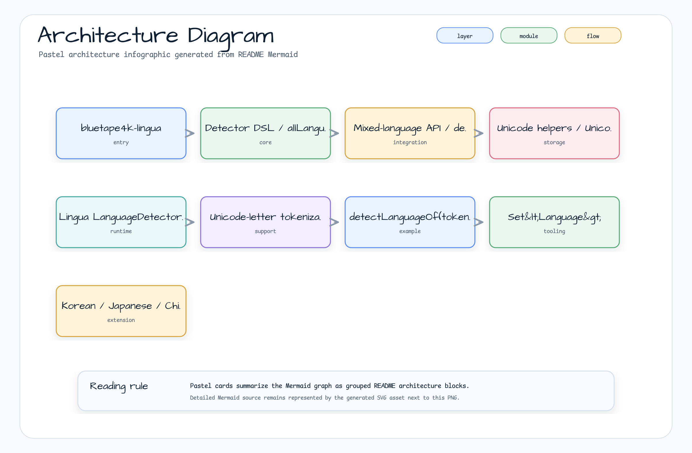
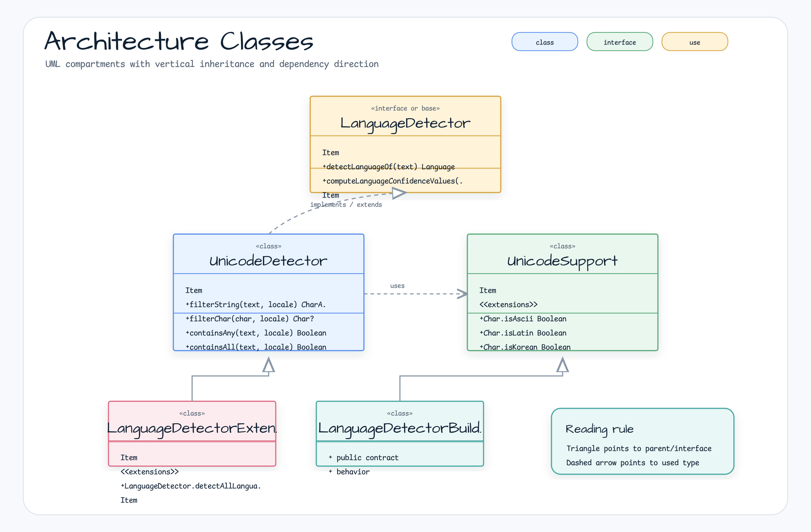

[한국어](./README.ko.md) | English

# lingua

A thin Kotlin DSL wrapper around `com.github.pemistahl:lingua` for language detection, plus a convenience API that returns all detected languages as a `Set<Language>` for mixed-language text.

## Architecture





## Features

- Kotlin DSL factory functions for creating Lingua `LanguageDetector` instances
- Builders from `Language`, `IsoCode639_1`, and `IsoCode639_3`
- `detectAllLanguagesOf(text): Set<Language>` extension for mixed-language text
- Short-Latin token ambiguity correction (e.g. `Hello → SOTHO` false-positive suppression)
- `UnicodeDetector` — filters characters by script (Korean, Japanese, Chinese, Thai)
- `UnicodeSupport` — `Char` extension properties per Unicode block range

## Usage

### Create a detector with the Kotlin DSL

```kotlin
import com.github.pemistahl.lingua.api.Language
import io.bluetape4k.lingua.allLanguageDetector

val detector = allLanguageDetector {
    withPreloadedLanguageModels()
    withMinimumRelativeDistance(0.0)
}

val language = detector.detectLanguageOf("Hello, world")
// Language.ENGLISH
```

### Detect all languages from mixed text

```kotlin
import com.github.pemistahl.lingua.api.Language
import io.bluetape4k.lingua.allLanguageDetector
import io.bluetape4k.lingua.detectAllLanguagesOf

val detector = allLanguageDetector {
    withMinimumRelativeDistance(0.0)
}

val languages = detector.detectAllLanguagesOf("Hello 안녕 こんにちは")
// setOf(Language.ENGLISH, Language.KOREAN, Language.JAPANESE)
```

### Build from a specific language subset

```kotlin
import com.github.pemistahl.lingua.api.Language
import io.bluetape4k.lingua.languageDetectorOf

// DSL variant
val detector = languageDetectorOf(setOf(Language.ENGLISH, Language.KOREAN)) {
    withMinimumRelativeDistance(0.0)
}

// Parameter variant
val detector2 = languageDetectorOf(
    languages = setOf(Language.ENGLISH, Language.KOREAN),
    minimumRelativeDistance = 0.0,
    isEveryLanguageModelPreloaded = true,
    isLowAccuracyModeEnabled = false
)
```

### Build from ISO codes

```kotlin
import com.github.pemistahl.lingua.api.IsoCode639_1
import io.bluetape4k.lingua.languageDetectorOf

val detector = languageDetectorOf(setOf(IsoCode639_1.EN, IsoCode639_1.KO)) {
    withMinimumRelativeDistance(0.0)
}
```

### Unicode character classification

```kotlin
import io.bluetape4k.lingua.isKorean
import io.bluetape4k.lingua.isJapanese
import java.util.Locale

'가'.isKorean   // true
'A'.isLatin     // true

val detector = UnicodeDetector()
val koreanChars = detector.filterString("Hello 안녕", Locale.KOREAN)
// ['안', '녕']

detector.containsAny("Hello 안녕", Locale.KOREAN)  // true
```

## Dependencies

| Dependency | Purpose |
|---|---|
| `bluetape4k-core` | Core utilities |
| `lingua` (`com.github.pemistahl:lingua`) | Upstream language detection engine (transitive) |

```kotlin
// build.gradle.kts
implementation("io.github.bluetape4k.text:lingua:<current release or snapshot>")
```

`lingua` already brings the upstream Lingua dependency transitively.

## Runnable Example

See [`../examples/lingua-examples`](../examples/lingua-examples) for a console
sample covering detector reuse, language subsets, low-accuracy mode, and
mixed-language text. Prefer reusing a configured `LanguageDetector` instance for
repeated calls; choose preloaded models when startup cost is acceptable and lazy
loading when smaller initial footprint matters.

> **Note**: Reuse detector instances instead of rebuilding them per call — model loading is expensive. Blank input returns `emptySet()`. If no usable per-token result is found, the extension falls back to whole-text detection.
