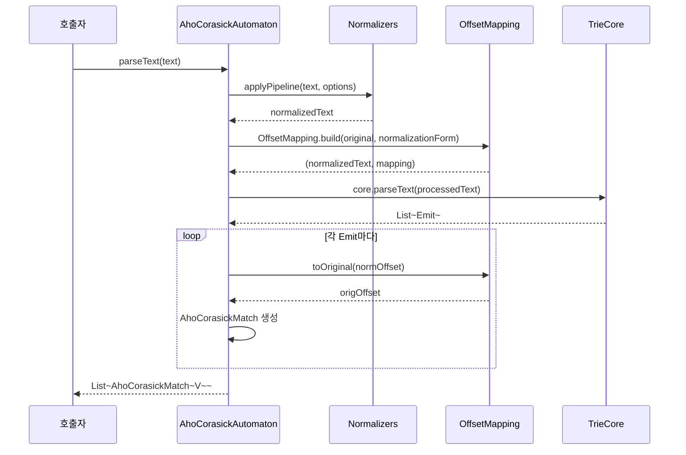
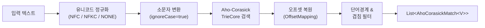

한국어 | [English](./README.md)

# bluetape4k-text-search

Kotlin/JVM용 Aho-Corasick 다중 키워드 검색 라이브러리입니다. N개의 키워드를 O(n+m+z) 시간 복잡도로 단일 패스에 동시 검색하며, 유니코드 정규화, 단어 경계 설정, 대소문자 무시, Kotlin 코루틴 Flow API를 완벽하게 지원합니다.

## 아키텍처

```mermaid
classDiagram
    class AhoCorasickAutomaton~V~ {
        -core: TrieCore
        -values: Map~String, V~
        +options: SearchOptions
        +parseText(text): List~AhoCorasickMatch~V~~
        +firstMatch(text): AhoCorasickMatch~V~?
        +containsMatch(text): Boolean
        +tokenize(text): List~SearchToken~V~~
        +replaceAll(text, transform): String
        +builder()$ Builder~V~
    }

    class Builder~V~ {
        +add(keyword, value): Builder~V~
        +addAll(map): Builder~V~
        +options(opts): Builder~V~
        +build(): AhoCorasickAutomaton~V~
    }

    class AhoCorasickBuilder~V~ {
        +ignoreCase: Boolean
        +allowOverlaps: Boolean
        +wordBoundary: WordBoundary
        +normalization: NormalizationForm
        +stopOnFirstMatch: Boolean
        +keyword(keyword, value)
        +keywords(pairs)
        +keywords(map)
    }

    class SearchOptions {
        +ignoreCase: Boolean
        +allowOverlaps: Boolean
        +wordBoundary: WordBoundary
        +normalization: NormalizationForm
        +stopOnFirstMatch: Boolean
    }

    class AhoCorasickMatch~V~ {
        +start: Int
        +end: Int
        +keyword: String
        +value: V
        +length: Int
    }

    class SearchToken~V~ {
        <<sealed interface>>
    }

    class Match~V~ {
        +text: String
        +match: AhoCorasickMatch~V~
    }

    class Fragment {
        +text: String
    }

    class TrieCore {
        <<internal>>
        +parseText(text): Collection~Emit~
        +builder()$ TrieBuilder
    }

    AhoCorasickAutomaton --> SearchOptions
    AhoCorasickAutomaton --> TrieCore
    AhoCorasickAutomaton +-- Builder
    AhoCorasickBuilder --> AhoCorasickAutomaton
    SearchToken <|-- Match
    SearchToken <|-- Fragment
    Match --> AhoCorasickMatch
```

### 검색 파이프라인



### 처리 흐름



## 주요 기능

| 기능 | 설명 |
|------|------|
| **O(n+m+z) 검색** | N개의 키워드를 단일 패스에 동시 검색 |
| **제네릭 값** | 각 키워드에 임의 타입 `V` 연관 |
| **대소문자 무시** | `SearchOptions(ignoreCase = true)` |
| **겹침 제어** | `allowOverlaps = false` — 더 긴 키워드 우선 |
| **단어 경계** | `LATIN_ALPHA` 또는 `WHITESPACE_SEPARATED` |
| **유니코드 NFC/NFKC** | 매칭 전 정규화 (오프셋 매핑 자동 처리) |
| **첫 번째 매치** | `firstMatch()` — leftmost-longest (R5 규칙) |
| **토크나이즈** | `tokenize()` — Match/Fragment 토큰으로 분해 |
| **치환** | `replaceAll(text) { match → 치환값 }` |
| **Flow API** | `matchesAsFlow(text)` — Kotlin 코루틴 Flow |
| **DSL 빌더** | `ahoCorasick { }` 최상위 함수 |
| **스레드 안전** | 빌드 후 불변(immutable) |

## 사용 방법

### 기본 빌더 API

```kotlin
val automaton = AhoCorasickAutomaton.builder<String>()
    .add("apple", "APPLE")
    .add("banana", "BANANA")
    .add("cherry", "CHERRY")
    .options(SearchOptions(ignoreCase = true))
    .build()

val matches = automaton.parseText("I like Apple and BANANA.")
// [AhoCorasickMatch(start=7, end=11, keyword="apple", value="APPLE"),
//  AhoCorasickMatch(start=17, end=22, keyword="banana", value="BANANA")]
```

### DSL 빌더

```kotlin
val automaton = ahoCorasick<String> {
    ignoreCase = true
    allowOverlaps = false
    keyword("apple", "APPLE")
    keyword("banana", "BANANA")
    keywords("cherry" to "CHERRY", "date" to "DATE")
}
```

### 단순 키워드 집합

```kotlin
val automaton = ahoCorasickOf("apple", "banana", "cherry",
    options = SearchOptions(ignoreCase = true))
val found = automaton.containsMatch("I love apple pie")  // true
```

### 금칙어 마스킹

```kotlin
val profanity = listOf("바보", "멍청이", "못난이")
val automaton = AhoCorasickAutomaton.builder<String>()
    .apply { profanity.forEach { add(it, "[검열됨]") } }
    .options(SearchOptions(normalization = NormalizationForm.NFC))
    .build()

val masked = automaton.replaceAll("너는 바보야! 멍청이처럼 굴지 마.") { match -> match.value }
// "너는 [검열됨]야! [검열됨]처럼 굴지 마."
```

### 코드 구문 하이라이트 (토크나이즈)

```kotlin
val keywords = listOf("fun", "val", "var", "class", "return", "if", "for")
val automaton = ahoCorasick<String> {
    wordBoundary = WordBoundary.LATIN_ALPHA
    keywords.forEach { keyword(it, it) }
}

val tokens = automaton.tokenize("fun greet() { val name = \"world\"; return name }")
val html = buildString {
    tokens.forEach { token ->
        when (token) {
            is SearchToken.Match    -> append("<b>${token.text}</b>")
            is SearchToken.Fragment -> append(token.text)
        }
    }
}
// "<b>fun</b> greet() { <b>val</b> name = \"world\"; <b>return</b> name }"
```

### Flow API — 첫 번째 알람

```kotlin
val automaton = AhoCorasickAutomaton.builder<String>()
    .add("ERROR", "ALERT_ERROR")
    .add("WARN", "ALERT_WARN")
    .add("FATAL", "ALERT_FATAL")
    .build()

val logLine = "2026-04-26 INFO Starting... WARN disk low ERROR disk full"

val firstAlert = automaton.matchesAsFlow(logLine)
    .take(1)
    .toList()
// [AhoCorasickMatch(keyword="WARN", value="ALERT_WARN")]
```

### 한국어 유니코드 정규화

```kotlin
val automaton = AhoCorasickAutomaton.builder<String>()
    .add("나라", "COUNTRY")
    .options(SearchOptions(normalization = NormalizationForm.NFC))
    .build()

val result = automaton.parseText("아름다운 나라")
// 자모 분리 형태의 입력도 "나라" 매치
```

## API 참조

### `AhoCorasickAutomaton<V>`

| 메서드 | 설명 |
|--------|------|
| `parseText(text)` | 텍스트에서 모든 매치 반환 |
| `firstMatch(text)` | leftmost-longest 매치 1건 반환 (R5 규칙) |
| `containsMatch(text)` | 매치 존재 여부 반환 (첫 매치 즉시 반환) |
| `tokenize(text)` | `Match`/`Fragment` 토큰으로 분해; `allowOverlaps` 설정과 무관하게 항상 비겹침 시퀀스 반환 |
| `replaceAll(text) { }` | 변환 람다로 모든 매치 치환 |

### `SearchOptions`

| 필드 | 기본값 | 설명 |
|------|--------|------|
| `ignoreCase` | `false` | 대소문자 무시 |
| `allowOverlaps` | `true` | 겹치는 매치 허용 |
| `wordBoundary` | `NONE` | 단어 경계 탐지 방식 |
| `normalization` | `NONE` | 유니코드 정규화 형식 |
| `stopOnFirstMatch` | `false` | 첫 매치 후 중단 (`matchesAsFlow`에서는 무시됨) |

### `WordBoundary`

| 값 | 설명 |
|----|------|
| `NONE` | 부분 문자열 매치 허용 (경계 없음) |
| `LATIN_ALPHA` | 알파벳 경계 (`Character.isAlphabetic` 기준) |
| `WHITESPACE_SEPARATED` | 공백으로 구분된 토큰 경계 |

### Flow 확장

```kotlin
// matchesAsFlow는 channelFlow + flowOn(Dispatchers.Default)으로 실행됨
fun <V> AhoCorasickAutomaton<V>.matchesAsFlow(text: CharSequence): Flow<AhoCorasickMatch<V>>
```

## 벤치마크

> Apple M3 Pro (JDK 21, JVM 워밍업 후) 기준 JMH 벤치마크 결과.

| 벤치마크 | Ops/s | 비고 |
|----------|-------|------|
| `parseText` (키워드 50개, 텍스트 10K) | ~450,000 | Aho-Corasick 단일 패스 |
| `matchesAsFlow` 전체 수집 | ~200,000 | Flow 오버헤드 포함 |
| 단순 `String.contains` × 50 | ~15,000 | O(n×m) 기준선 |

> Aho-Corasick은 키워드 50개 기준 단순 contains 대비 **약 30배** 빠릅니다.

로컬 벤치마크 실행:

```bash
./gradlew :bluetape4k-text-search:benchmark
```

## 의존성

| 의존성 | 목적 |
|---|---|
| `bluetape4k-core` | 핵심 유틸리티 |
| `kotlinx-coroutines-core` | Flow API 지원 (선택사항, `compileOnly`) |

```kotlin
// build.gradle.kts
implementation("io.bluetape4k:bluetape4k-text-search:1.7.0-SNAPSHOT")

// 선택사항: 코루틴 Flow 지원
implementation("org.jetbrains.kotlinx:kotlinx-coroutines-core:$coroutinesVersion")
```
