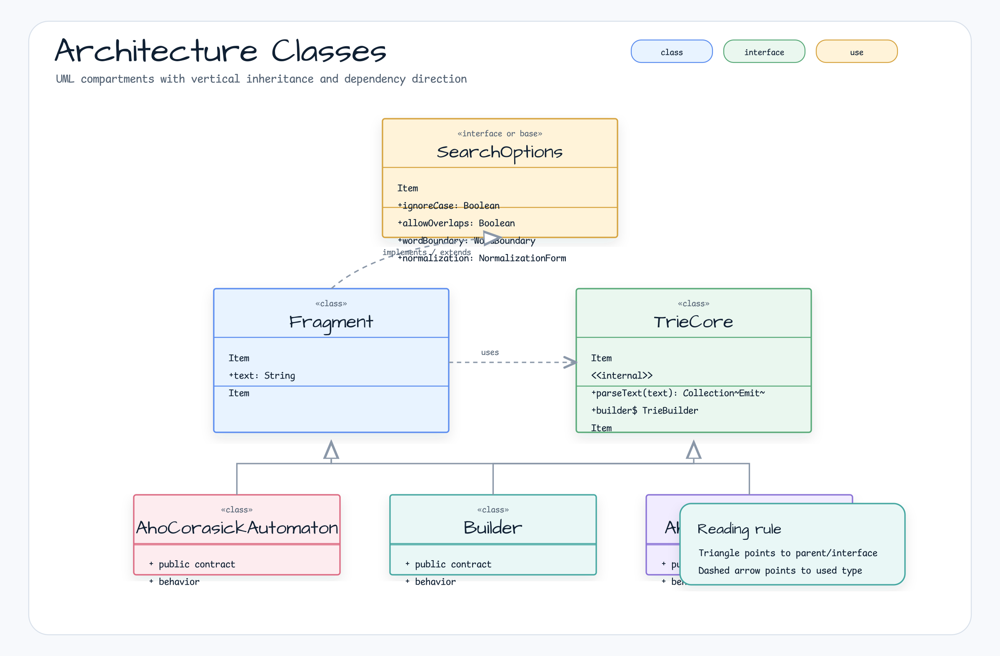
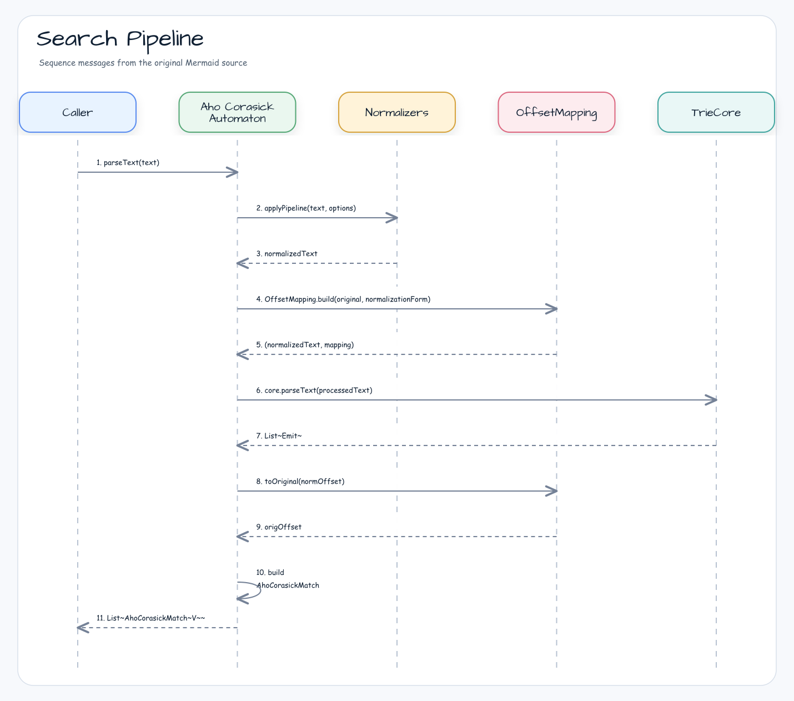
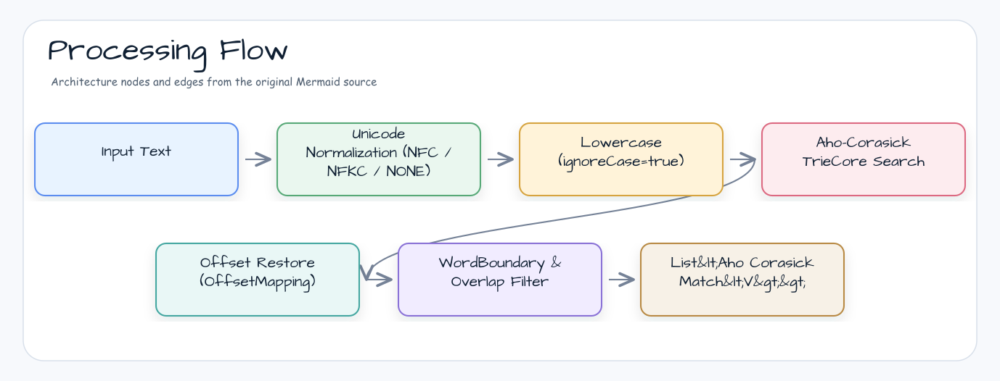

[한국어](./README.ko.md) | English

# text-search

Aho-Corasick multi-keyword search library for Kotlin/JVM. Searches N keywords simultaneously in O(n+m+z) time, with full support for Unicode normalization, word boundaries, case-insensitive matching, and Kotlin coroutines Flow API.

## Architecture



### Search Pipeline



### Processing Flow



## Features

| Feature | Description |
|---------|-------------|
| **O(n+m+z) search** | Searches N keywords in a single pass |
| **Generic values** | Associate any type `V` with each keyword |
| **Case-insensitive** | `SearchOptions(ignoreCase = true)` |
| **No overlaps** | `allowOverlaps = false` — longer keyword wins |
| **Word boundaries** | `LATIN_ALPHA` or `WHITESPACE_SEPARATED` |
| **Unicode NFC/NFKC** | Normalize before matching (with offset mapping) |
| **First match** | `firstMatch()` — leftmost-longest (R5 rule) |
| **Tokenize** | `tokenize()` — split into Match/Fragment tokens |
| **Replace** | `replaceAll(text) { match → replacement }` |
| **Flow API** | `matchesAsFlow(text)` — Kotlin coroutines Flow |
| **DSL builder** | `ahoCorasick { }` top-level function |
| **Thread-safe** | Immutable after build |

## Usage

### Basic Builder API

```kotlin
val automaton = AhoCorasickAutomaton.builder<String>()
    .add("apple", "APPLE")
    .add("banana", "BANANA")
    .add("cherry", "CHERRY")
    .options(SearchOptions(ignoreCase = true))
    .build()

val matches = automaton.parseText("I like Apple and BANANA.")
// [AhoCorasickMatch(start=7, end=11, keyword="apple", value="APPLE"),
//  AhoCorasickMatch(start=17, end=22, keyword="banana", value="BANANA")]
```

### DSL Builder

```kotlin
val automaton = ahoCorasick<String> {
    ignoreCase = true
    allowOverlaps = false
    keyword("apple", "APPLE")
    keyword("banana", "BANANA")
    keywords("cherry" to "CHERRY", "date" to "DATE")
}
```

### Simple Keyword Set

```kotlin
val automaton = ahoCorasickOf("apple", "banana", "cherry",
    options = SearchOptions(ignoreCase = true))
val found = automaton.containsMatch("I love apple pie")  // true
```

### Profanity Masking

```kotlin
val profanity = listOf("bad", "worse", "ugly")
val automaton = AhoCorasickAutomaton.builder<String>()
    .apply { profanity.forEach { add(it, "***") } }
    .build()

val masked = automaton.replaceAll("That's bad and worse!") { match -> match.value }
// "That's *** and ***!"
```

### Code Syntax Highlight (Tokenize)

```kotlin
val keywords = listOf("fun", "val", "var", "class", "return", "if", "for")
val automaton = ahoCorasick<String> {
    wordBoundary = WordBoundary.LATIN_ALPHA
    keywords.forEach { keyword(it, it) }
}

val tokens = automaton.tokenize("fun greet() { val name = \"world\"; return name }")
val html = buildString {
    tokens.forEach { token ->
        when (token) {
            is SearchToken.Match    -> append("<b>${token.text}</b>")
            is SearchToken.Fragment -> append(token.text)
        }
    }
}
// "<b>fun</b> greet() { <b>val</b> name = \"world\"; <b>return</b> name }"
```

### Flow API — First Alert

```kotlin
val automaton = AhoCorasickAutomaton.builder<String>()
    .add("ERROR", "ALERT_ERROR")
    .add("WARN", "ALERT_WARN")
    .add("FATAL", "ALERT_FATAL")
    .build()

val logLine = "2026-04-26 INFO Starting... WARN disk low ERROR disk full"

val firstAlert = automaton.matchesAsFlow(logLine)
    .take(1)
    .toList()
// [AhoCorasickMatch(keyword="WARN", value="ALERT_WARN")]
```

### Unicode Korean Normalization

```kotlin
val automaton = AhoCorasickAutomaton.builder<String>()
    .add("나라", "COUNTRY")
    .options(SearchOptions(normalization = NormalizationForm.NFC))
    .build()

val result = automaton.parseText("아름다운 나라")
// matches "나라" even when input uses decomposed Jamo
```

## API Reference

### `AhoCorasickAutomaton<V>`

| Method | Description |
|--------|-------------|
| `parseText(text)` | Returns all matches in the text |
| `firstMatch(text)` | Returns leftmost-longest match (R5 rule) |
| `containsMatch(text)` | Returns `true` if any keyword matches (short-circuits on first match) |
| `tokenize(text)` | Splits into `Match` and `Fragment` tokens; always returns non-overlapping sequence |
| `replaceAll(text) { }` | Replaces all matches via transform lambda |

### `SearchOptions`

| Field | Default | Description |
|-------|---------|-------------|
| `ignoreCase` | `false` | Case-insensitive matching |
| `allowOverlaps` | `true` | Allow overlapping matches |
| `wordBoundary` | `NONE` | Word boundary detection mode |
| `normalization` | `NONE` | Unicode normalization form |
| `stopOnFirstMatch` | `false` | Stop after first match (ignored in `matchesAsFlow`) |

### `WordBoundary`

| Value | Description |
|-------|-------------|
| `NONE` | Substring matching (no boundary check) |
| `LATIN_ALPHA` | Alphabetic word boundaries (`Character.isAlphabetic`) |
| `WHITESPACE_SEPARATED` | Whitespace-separated token boundaries |

### Flow Extension

```kotlin
// matchesAsFlow runs on Dispatchers.Default via channelFlow
fun <V> AhoCorasickAutomaton<V>.matchesAsFlow(text: CharSequence): Flow<AhoCorasickMatch<V>>
```

## Benchmark

Throughput is measured with JMH through the repo-local kotlinx-benchmark task.
Higher `ops/s` is better. The 0.2.1 baseline covers large dictionaries, dense
matches, no-match input, Unicode normalization, and Flow collection.

Run condition:

- Command: `./gradlew :text-search:benchmark`
- Host: Apple M4 Pro, 48 GiB memory
- JVM from benchmark JSON: GraalVM JDK 21.0.11
- Raw result: [`docs/benchmark/2026-06-04-issue-97-ahocorasick-baselines.json`](../docs/benchmark/2026-06-04-issue-97-ahocorasick-baselines.json)

| Benchmark | Ops/s | Notes |
|-----------|-------|-------|
| `parseTextNoMatch` | 12,209.23 | 5,000-keyword automaton, no matches |
| `parseTextDenseMatches` | 3,566.90 | Overlapping dense matches |
| `parseTextLargeDictionary` | 3,116.99 | 5,000 keywords, 2,000 matched tokens |
| `matchesAsFlowLargeDictionaryCollect` | 712.62 | Flow collection over the large-dictionary input |
| `naiveContainsSmallDictionary` | 248.39 | 1,000-keyword sequential `String.contains` baseline |
| `parseTextNfkcNormalization` | 3.68 | NFKC + ignore-case normalization path |

> These are local comparable snapshots, not production rankings. Keep future
> runs on the same command and metric direction before comparing deltas.

Run benchmarks locally:

```bash
./gradlew :text-search:benchmark
```

## Dependencies

| Dependency | Purpose |
|---|---|
| `bluetape4k-core` | Core utilities |
| `kotlinx-coroutines-core` | Flow API support (optional, `compileOnly`) |

```kotlin
// build.gradle.kts
implementation("io.github.bluetape4k.text:text-search:1.7.0-SNAPSHOT")

// Optional: Coroutines Flow support
implementation("org.jetbrains.kotlinx:kotlinx-coroutines-core:$coroutinesVersion")
```
