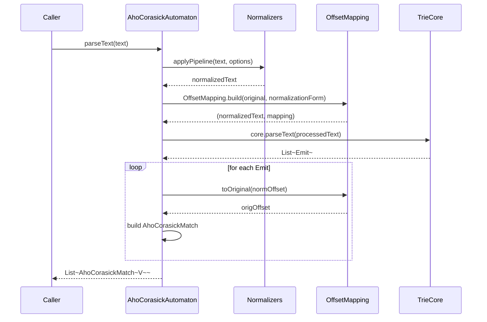
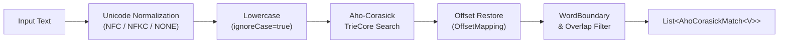

[한국어](./README.ko.md) | English

# bluetape4k-text-search

Aho-Corasick multi-keyword search library for Kotlin/JVM. Searches N keywords simultaneously in O(n+m+z) time, with full support for Unicode normalization, word boundaries, case-insensitive matching, and Kotlin coroutines Flow API.

## Architecture

```mermaid
classDiagram
    class AhoCorasickAutomaton~V~ {
        -core: TrieCore
        -values: Map~String, V~
        +options: SearchOptions
        +parseText(text): List~AhoCorasickMatch~V~~
        +firstMatch(text): AhoCorasickMatch~V~?
        +containsMatch(text): Boolean
        +tokenize(text): List~SearchToken~V~~
        +replaceAll(text, transform): String
        +builder()$ Builder~V~
    }

    class Builder~V~ {
        +add(keyword, value): Builder~V~
        +addAll(map): Builder~V~
        +options(opts): Builder~V~
        +build(): AhoCorasickAutomaton~V~
    }

    class AhoCorasickBuilder~V~ {
        +ignoreCase: Boolean
        +allowOverlaps: Boolean
        +wordBoundary: WordBoundary
        +normalization: NormalizationForm
        +stopOnFirstMatch: Boolean
        +keyword(keyword, value)
        +keywords(pairs)
        +keywords(map)
    }

    class SearchOptions {
        +ignoreCase: Boolean
        +allowOverlaps: Boolean
        +wordBoundary: WordBoundary
        +normalization: NormalizationForm
        +stopOnFirstMatch: Boolean
    }

    class AhoCorasickMatch~V~ {
        +start: Int
        +end: Int
        +keyword: String
        +value: V
        +length: Int
    }

    class SearchToken~V~ {
        <<sealed interface>>
    }

    class Match~V~ {
        +text: String
        +match: AhoCorasickMatch~V~
    }

    class Fragment {
        +text: String
    }

    class TrieCore {
        <<internal>>
        +parseText(text): Collection~Emit~
        +builder()$ TrieBuilder
    }

    AhoCorasickAutomaton --> SearchOptions
    AhoCorasickAutomaton --> TrieCore
    AhoCorasickAutomaton +-- Builder
    AhoCorasickBuilder --> AhoCorasickAutomaton
    SearchToken <|-- Match
    SearchToken <|-- Fragment
    Match --> AhoCorasickMatch
```

### Search Pipeline



### Processing Flow



## Features

| Feature | Description |
|---------|-------------|
| **O(n+m+z) search** | Searches N keywords in a single pass |
| **Generic values** | Associate any type `V` with each keyword |
| **Case-insensitive** | `SearchOptions(ignoreCase = true)` |
| **No overlaps** | `allowOverlaps = false` — longer keyword wins |
| **Word boundaries** | `LATIN_ALPHA` or `WHITESPACE_SEPARATED` |
| **Unicode NFC/NFKC** | Normalize before matching (with offset mapping) |
| **First match** | `firstMatch()` — leftmost-longest (R5 rule) |
| **Tokenize** | `tokenize()` — split into Match/Fragment tokens |
| **Replace** | `replaceAll(text) { match → replacement }` |
| **Flow API** | `matchesAsFlow(text)` — Kotlin coroutines Flow |
| **DSL builder** | `ahoCorasick { }` top-level function |
| **Thread-safe** | Immutable after build |

## Usage

### Basic Builder API

```kotlin
val automaton = AhoCorasickAutomaton.builder<String>()
    .add("apple", "APPLE")
    .add("banana", "BANANA")
    .add("cherry", "CHERRY")
    .options(SearchOptions(ignoreCase = true))
    .build()

val matches = automaton.parseText("I like Apple and BANANA.")
// [AhoCorasickMatch(start=7, end=11, keyword="apple", value="APPLE"),
//  AhoCorasickMatch(start=17, end=22, keyword="banana", value="BANANA")]
```

### DSL Builder

```kotlin
val automaton = ahoCorasick<String> {
    ignoreCase = true
    allowOverlaps = false
    keyword("apple", "APPLE")
    keyword("banana", "BANANA")
    keywords("cherry" to "CHERRY", "date" to "DATE")
}
```

### Simple Keyword Set

```kotlin
val automaton = ahoCorasickOf("apple", "banana", "cherry",
    options = SearchOptions(ignoreCase = true))
val found = automaton.containsMatch("I love apple pie")  // true
```

### Profanity Masking

```kotlin
val profanity = listOf("bad", "worse", "ugly")
val automaton = AhoCorasickAutomaton.builder<String>()
    .apply { profanity.forEach { add(it, "***") } }
    .build()

val masked = automaton.replaceAll("That's bad and worse!") { match -> match.value }
// "That's *** and ***!"
```

### Code Syntax Highlight (Tokenize)

```kotlin
val keywords = listOf("fun", "val", "var", "class", "return", "if", "for")
val automaton = ahoCorasick<String> {
    wordBoundary = WordBoundary.LATIN_ALPHA
    keywords.forEach { keyword(it, it) }
}

val tokens = automaton.tokenize("fun greet() { val name = \"world\"; return name }")
val html = buildString {
    tokens.forEach { token ->
        when (token) {
            is SearchToken.Match    -> append("<b>${token.text}</b>")
            is SearchToken.Fragment -> append(token.text)
        }
    }
}
// "<b>fun</b> greet() { <b>val</b> name = \"world\"; <b>return</b> name }"
```

### Flow API — First Alert

```kotlin
val automaton = AhoCorasickAutomaton.builder<String>()
    .add("ERROR", "ALERT_ERROR")
    .add("WARN", "ALERT_WARN")
    .add("FATAL", "ALERT_FATAL")
    .build()

val logLine = "2026-04-26 INFO Starting... WARN disk low ERROR disk full"

val firstAlert = automaton.matchesAsFlow(logLine)
    .take(1)
    .toList()
// [AhoCorasickMatch(keyword="WARN", value="ALERT_WARN")]
```

### Unicode Korean Normalization

```kotlin
val automaton = AhoCorasickAutomaton.builder<String>()
    .add("나라", "COUNTRY")
    .options(SearchOptions(normalization = NormalizationForm.NFC))
    .build()

val result = automaton.parseText("아름다운 나라")
// matches "나라" even when input uses decomposed Jamo
```

## API Reference

### `AhoCorasickAutomaton<V>`

| Method | Description |
|--------|-------------|
| `parseText(text)` | Returns all matches in the text |
| `firstMatch(text)` | Returns leftmost-longest match (R5 rule) |
| `containsMatch(text)` | Returns `true` if any keyword matches (short-circuits on first match) |
| `tokenize(text)` | Splits into `Match` and `Fragment` tokens; always returns non-overlapping sequence |
| `replaceAll(text) { }` | Replaces all matches via transform lambda |

### `SearchOptions`

| Field | Default | Description |
|-------|---------|-------------|
| `ignoreCase` | `false` | Case-insensitive matching |
| `allowOverlaps` | `true` | Allow overlapping matches |
| `wordBoundary` | `NONE` | Word boundary detection mode |
| `normalization` | `NONE` | Unicode normalization form |
| `stopOnFirstMatch` | `false` | Stop after first match (ignored in `matchesAsFlow`) |

### `WordBoundary`

| Value | Description |
|-------|-------------|
| `NONE` | Substring matching (no boundary check) |
| `LATIN_ALPHA` | Alphabetic word boundaries (`Character.isAlphabetic`) |
| `WHITESPACE_SEPARATED` | Whitespace-separated token boundaries |

### Flow Extension

```kotlin
// matchesAsFlow runs on Dispatchers.Default via channelFlow
fun <V> AhoCorasickAutomaton<V>.matchesAsFlow(text: CharSequence): Flow<AhoCorasickMatch<V>>
```

## Benchmark

> Results from JMH benchmark on Apple M3 Pro (JDK 21, JVM warm).

| Benchmark | Ops/s | Notes |
|-----------|-------|-------|
| `parseText` (50 keywords, 10K text) | ~450,000 | Single-pass Aho-Corasick |
| `matchesAsFlow` collect | ~200,000 | Flow overhead included |
| Naive `String.contains` × 50 | ~15,000 | O(n×m) baseline |

> Aho-Corasick provides **~30× speedup** over naive contains check with 50 keywords.

Run benchmarks locally:

```bash
./gradlew :bluetape4k-text-search:benchmark
```

## Dependencies

| Dependency | Purpose |
|---|---|
| `bluetape4k-core` | Core utilities |
| `kotlinx-coroutines-core` | Flow API support (optional, `compileOnly`) |

```kotlin
// build.gradle.kts
implementation("io.bluetape4k:bluetape4k-text-search:1.7.0-SNAPSHOT")

// Optional: Coroutines Flow support
implementation("org.jetbrains.kotlinx:kotlinx-coroutines-core:$coroutinesVersion")
```
