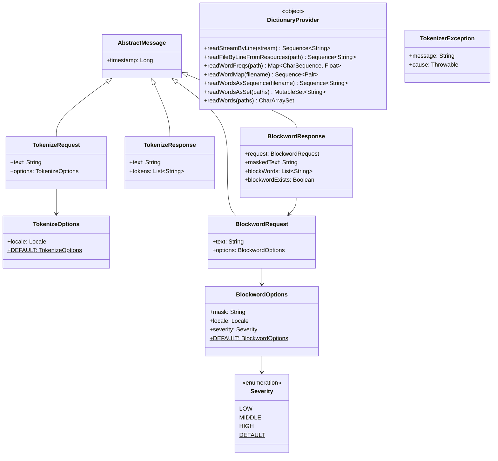

한국어 | [English](./README.md)

# bluetape4k-tokenizer-core

bluetape4k 생태계에서 텍스트 토크나이저와 금칙어 처리기를 구축하기 위한 핵심 추상화, 도메인 모델, 유틸리티를 제공하는 모듈입니다.

## 아키텍처



## 주요 기능

- **도메인 모델 계층** — `TokenizeRequest` / `TokenizeResponse`와 `BlockwordRequest` / `BlockwordResponse` — 인스턴스 생성 시각 자동 기록
- **설정 가능한 옵션** — `TokenizeOptions`(로캘)과 `BlockwordOptions`(마스크 문자, 로캘, 심각도 수준)
- **심각도 열거형** — `Severity.LOW`(은어/속어), `MIDDLE`(욕설), `HIGH`(혐오 표현/지역 비하) 세 단계 콘텐츠 정책
- **사전 유틸리티** — `DictionaryProvider`가 클래스패스 리소스 파일(일반 텍스트 또는 `.gz`)을 지연 `Sequence`, 단어 빈도 맵, 또는 고성능 `CharArraySet`으로 로드
- **병렬 사전 로딩** — `readWordsAsSet`과 `readWords`가 `Flow.async`를 이용해 여러 사전 파일을 동시 적재
- **고성능 집합/맵 구조** — 대용량 단어 목록 멤버십 검사에 최적화된 `CharArraySet`과 `CharArrayMap`
- **예외 계층** — `TokenizerException`과 `InvalidTokenizeRequestException`이 `BluetapeException` 상속
- **직렬화 가능 모델** — 모든 옵션 및 메시지 타입이 `java.io.Serializable` 구현

## 사용법

### 형태소 분석 요청 / 응답

```kotlin
import io.bluetape4k.tokenizer.model.*
import java.util.Locale

// 기본 옵션(Locale.KOREAN)으로 요청 생성
val request = tokenizeRequestOf("코틀린 코루틴")
println(request.text)       // 코틀린 코루틴
println(request.timestamp)  // 생성 시각 (epoch millis)

// 로캘 지정
val jpOptions = TokenizeOptions(locale = Locale.JAPANESE)
val jpRequest = tokenizeRequestOf("日本語テスト", jpOptions)

// 응답 생성 (실제 토크나이저 구현체가 채워 넣음)
val response = tokenizeResponseOf(request.text, listOf("코틀린", "코루틴"))
println(response.tokens)    // [코틀린, 코루틴]
```

### 금칙어 요청 / 응답

```kotlin
import io.bluetape4k.tokenizer.model.*

// 기본값: mask = "*", severity = LOW
val req = blockwordRequestOf("나쁜 단어가 포함된 문장")

// 마스크 문자와 심각도 커스터마이징
val opts = blockwordOptionsOf(mask = "#", severity = Severity.HIGH)
val req2 = blockwordRequestOf("some text", opts)

// 금칙어 처리기가 반환한 응답 확인
val response = blockwordResponseOf(req, "나쁜 ***가 포함된 문장", listOf("단어"))
println(response.blockwordExists)   // true
println(response.maskedText)        // 나쁜 ***가 포함된 문장
```

### 클래스패스 리소스에서 사전 로드

```kotlin
import io.bluetape4k.tokenizer.utils.DictionaryProvider
import kotlinx.coroutines.runBlocking

// 지연 시퀀스 — 라인 단위 읽기
val words: Sequence<String> = DictionaryProvider.readWordsAsSequence("dict/stopwords.txt")

// 여러 파일을 병렬로 읽어 CharArraySet에 적재
val set = runBlocking {
    DictionaryProvider.readWords("dict/a.txt", "dict/b.txt")
}
println(set.contains("foo"))  // 두 파일 중 하나에 "foo"가 있으면 true

// 탭 구분 단어-빈도 파일 읽기 (형식: 단어\t빈도)
val freqMap: Map<CharSequence, Float> = DictionaryProvider.readWordFreqs("dict/freqs.txt")
```

## 의존성

| 의존성 | 역할 |
|---|---|
| `bluetape4k-io` | I/O 기반 유틸리티 및 `BluetapeException` |
| `bluetape4k-coroutines` | 병렬 사전 로딩을 위한 `Flow.async` |
| `kotlinx-coroutines-core` | 코루틴 런타임 |

```kotlin
dependencies {
    implementation("io.bluetape4k:bluetape4k-tokenizer-core:1.7.0-SNAPSHOT")
}
```
