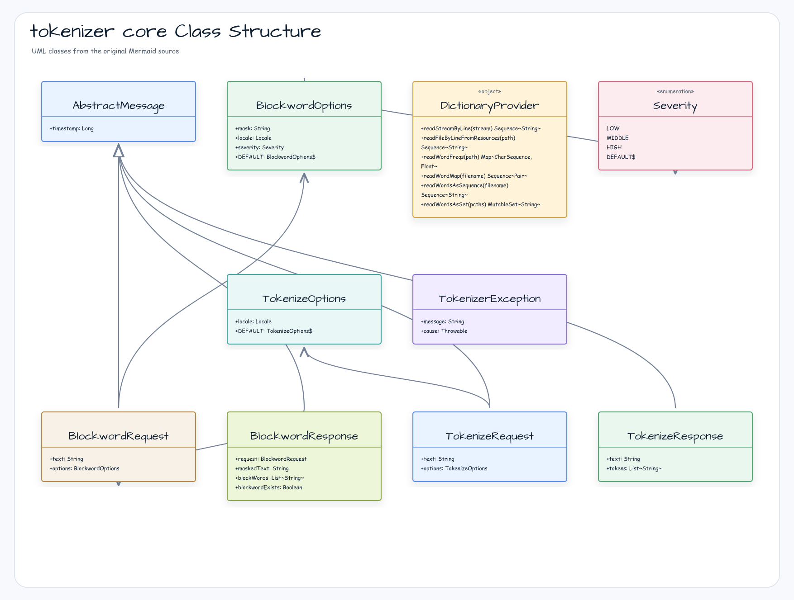

한국어 | [English](./README.md)

# tokenizer-core

bluetape4k 생태계에서 텍스트 토크나이저와 금칙어 처리기를 구축하기 위한 핵심 추상화, 도메인 모델, 유틸리티를 제공하는 모듈입니다.

## 아키텍처



## 주요 기능

- **도메인 모델 계층** — `TokenizeRequest` / `TokenizeResponse`와 `BlockwordRequest` / `BlockwordResponse` — 인스턴스 생성 시각 자동 기록
- **설정 가능한 옵션** — `TokenizeOptions`(로캘)과 `BlockwordOptions`(마스크 문자, 로캘, 심각도 수준)
- **심각도 열거형** — `Severity.LOW`(은어/속어), `MIDDLE`(욕설), `HIGH`(혐오 표현/지역 비하) 세 단계 콘텐츠 정책
- **사전 유틸리티** — `DictionaryProvider`가 클래스패스 리소스 파일(일반 텍스트 또는 `.gz`)을 즉시 메모리에 적재한 `Sequence` 스냅샷, 단어 빈도 맵, 또는 고성능 `CharArraySet`으로 로드
- **병렬 사전 로딩** — `readWordsAsSet`과 `readWords`가 `Flow.async`를 이용해 여러 사전 파일을 동시 적재
- **성공 전용 suspend memoization** — `SuspendMemoized`가 동시 초기화를 하나로 합치고 성공 값만 재사용하며, 실패·취소 후 재시도와 blocking interruption flag 복구를 보장
- **고성능 집합/맵 구조** — 대용량 단어 목록 멤버십 검사에 최적화된 `CharArraySet`과 `CharArrayMap`
- **예외 계층** — `TokenizerException`과 `InvalidTokenizeRequestException`이 `BluetapeException` 상속
- **직렬화 가능 모델** — 모든 옵션 및 메시지 타입이 `java.io.Serializable` 구현

## 사용법

### 형태소 분석 요청 / 응답

```kotlin
import io.bluetape4k.tokenizer.model.*
import java.util.Locale

// 기본 옵션(Locale.KOREAN)으로 요청 생성
val request = tokenizeRequestOf("코틀린 코루틴")
println(request.text)       // 코틀린 코루틴
println(request.timestamp)  // 생성 시각 (epoch millis)

// 로캘 지정
val jpOptions = TokenizeOptions(locale = Locale.JAPANESE)
val jpRequest = tokenizeRequestOf("日本語テスト", jpOptions)

// 응답 생성 (실제 토크나이저 구현체가 채워 넣음)
val response = tokenizeResponseOf(request.text, listOf("코틀린", "코루틴"))
println(response.tokens)    // [코틀린, 코루틴]
```

### 금칙어 요청 / 응답

```kotlin
import io.bluetape4k.tokenizer.model.*

// 기본값: mask = "*", severity = LOW
val req = blockwordRequestOf("나쁜 단어가 포함된 문장")

// 마스크 문자와 심각도 커스터마이징
val opts = blockwordOptionsOf(mask = "#", severity = Severity.HIGH)
val req2 = blockwordRequestOf("some text", opts)

// 금칙어 처리기가 반환한 응답 확인
val response = blockwordResponseOf(req, "나쁜 ***가 포함된 문장", listOf("단어"))
println(response.blockwordExists)   // true
println(response.maskedText)        // 나쁜 ***가 포함된 문장
```

### 클래스패스 리소스에서 사전 로드

```kotlin
import io.bluetape4k.tokenizer.utils.DictionaryProvider
import kotlinx.coroutines.runBlocking

// 즉시 메모리 스냅샷 — 반환 전에 리소스를 모두 읽고 닫습니다
val words: Sequence<String> = DictionaryProvider.readWordsAsSequence("dict/stopwords.txt")

// 여러 파일을 병렬로 읽어 CharArraySet에 적재
val set = runBlocking {
    DictionaryProvider.readWords("dict/a.txt", "dict/b.txt")
}
println(set.contains("foo"))  // 두 파일 중 하나에 "foo"가 있으면 true

// 탭 구분 단어-빈도 파일 읽기 (형식: 단어\t빈도)
val freqMap: Map<CharSequence, Float> = DictionaryProvider.readWordFreqs("dict/freqs.txt")
```

`readWordsAsSequence`는 반환 전에 리소스 전체를 읽고 stream을 닫습니다.
따라서 `take(2)`는 읽기가 끝난 뒤 Sequence 순회량만 줄이며, 파일 I/O나
최대 메모리 사용량을 줄이지 않습니다. 중복을 제거한 membership 조회가
필요하면 `readWordsAsSet`을 사용하세요.

### 성공 전용 suspend 초기화

`SuspendMemoized`는 동시 호출을 하나의 초기화로 합치고 성공한 값만 저장합니다.
initializer가 실패하거나 호출 코루틴이 취소되면 결과를 저장하지 않아 다음 호출이
재시도합니다. 동기 facade에서는 `getBlocking()`을 사용하며, 초기화 대기 중 호출
스레드가 interrupt되면 `InterruptedException`을 전달하면서 interrupt flag를 복구합니다.

```kotlin
import io.bluetape4k.tokenizer.utils.SuspendMemoized
import kotlinx.coroutines.runBlocking

val dictionary = SuspendMemoized {
    mapOf("sample" to "value")
}

val value = runBlocking { dictionary.get() }
val sameValue = dictionary.getBlocking()
// value == sameValue
```

`clear()`는 명시적으로 성공 값을 제거하고 다음 호출에서 initializer를 다시 실행하도록
합니다. `isInitialized()`는 성공 값의 공개 여부를 확인합니다.

## 의존성

| 의존성 | 역할 |
|---|---|
| `bluetape4k-io` | I/O 기반 유틸리티 및 `BluetapeException` |
| `bluetape4k-coroutines` | 병렬 사전 로딩을 위한 `Flow.async` |
| `kotlinx-coroutines-core` | 코루틴 런타임 |

```kotlin
dependencies {
    implementation("io.github.bluetape4k.text:tokenizer-core:<current release or snapshot>")
}
```

## 웹 서비스 입력 경계

`TokenizeRequest`와 `BlockwordRequest`는 processor 작업 전에 입력을 검증합니다.
blank text는 invalid이고, tokenizer 요청은 `MAX_TOKENIZE_TEXT_LENGTH`, blockword
요청은 `MAX_BLOCKWORD_TEXT_LENGTH`를 초과할 수 없습니다. HTTP adapter는 blank
입력을 `400 Bad Request`, 너무 긴 입력을 `413 Payload Too Large`로 매핑하는 것이
좋습니다. 오류 응답에는 status, 실제 길이, 최대 길이만 담으세요.

```kotlin
import io.bluetape4k.tokenizer.model.MAX_BLOCKWORD_TEXT_LENGTH
import io.bluetape4k.tokenizer.model.MAX_TOKENIZE_TEXT_LENGTH
import io.bluetape4k.tokenizer.model.blockwordRequestOf
import io.bluetape4k.tokenizer.model.tokenizeRequestOf

fun tokenizeStatus(text: String): Int =
    when {
        text.isBlank() -> 400
        text.length > MAX_TOKENIZE_TEXT_LENGTH -> 413
        else -> {
            tokenizeRequestOf(text)
            200
        }
    }

fun blockwordStatus(text: String): Int =
    when {
        text.isBlank() -> 400
        text.length > MAX_BLOCKWORD_TEXT_LENGTH -> 413
        else -> {
            blockwordRequestOf(text)
            200
        }
    }
```

실행 가능한 예제는
[`../examples/tokenizer-safety-examples`](../examples/tokenizer-safety-examples)를 참고하세요.
