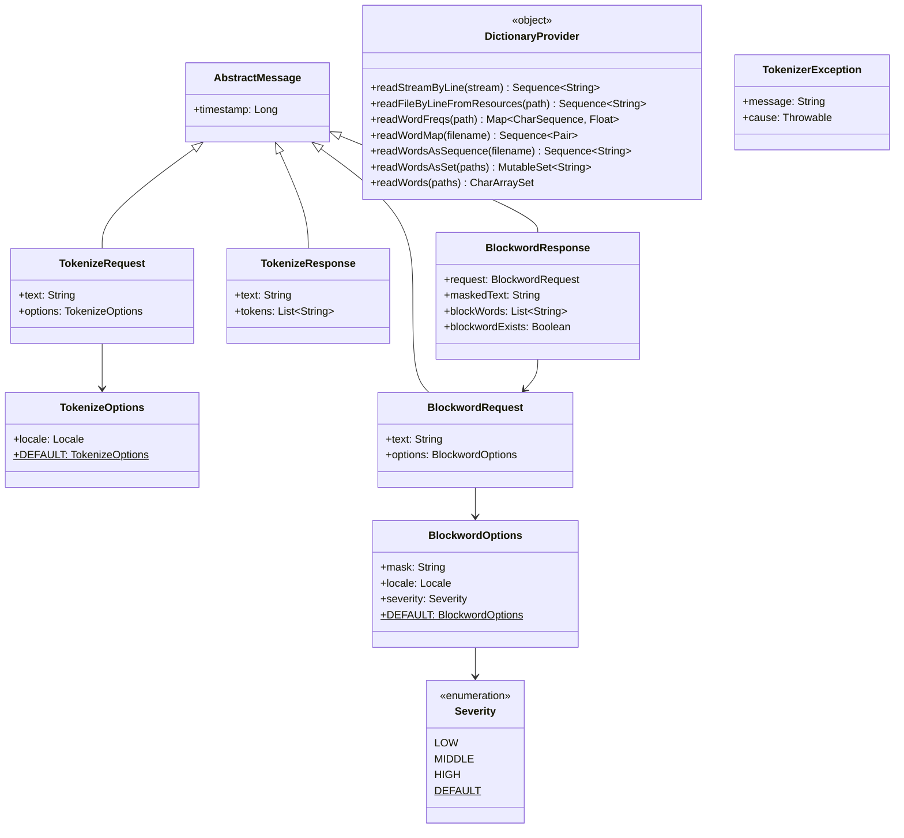

[한국어](./README.ko.md) | English

# bluetape4k-tokenizer-core

Core abstractions, domain models, and utilities for building text tokenizers and blockword processors in the bluetape4k ecosystem.

## Architecture



## Features

- **Domain model layer** — `TokenizeRequest` / `TokenizeResponse` and `BlockwordRequest` / `BlockwordResponse` with automatic timestamp recording
- **Configurable options** — `TokenizeOptions` (locale) and `BlockwordOptions` (mask character, locale, severity level)
- **Severity enum** — `Severity.LOW` (slang/mild), `MIDDLE` (profanity), `HIGH` (hate speech / regional slurs) for fine-grained content policy
- **Dictionary utilities** — `DictionaryProvider` loads classpath resource files (plain text or `.gz`) as lazy `Sequence`, word-frequency maps, or high-performance `CharArraySet`
- **Parallel dictionary loading** — `readWordsAsSet` and `readWords` use `Flow.async` to load multiple dictionary files concurrently
- **Efficient set/map structures** — `CharArraySet` and `CharArrayMap` optimised for high-throughput membership checks against large word lists
- **Exception hierarchy** — `TokenizerException` and `InvalidTokenizeRequestException` extend `BluetapeException`
- **Serializable models** — all options and message types implement `java.io.Serializable`

## Usage

### Tokenize request / response

```kotlin
import io.bluetape4k.tokenizer.model.*
import java.util.Locale

// Build a request with default options (Locale.KOREAN)
val request = tokenizeRequestOf("코틀린 코루틴")
println(request.text)       // 코틀린 코루틴
println(request.timestamp)  // epoch millis

// Build with custom locale
val jpOptions = TokenizeOptions(locale = Locale.JAPANESE)
val jpRequest = tokenizeRequestOf("日本語テスト", jpOptions)

// Construct a response (tokenizer implementations populate this)
val response = tokenizeResponseOf(request.text, listOf("코틀린", "코루틴"))
println(response.tokens)    // [코틀린, 코루틴]
```

### Blockword request / response

```kotlin
import io.bluetape4k.tokenizer.model.*

// Default: mask = "*", severity = LOW
val req = blockwordRequestOf("나쁜 단어가 포함된 문장")

// Custom mask character and severity
val opts = blockwordOptionsOf(mask = "#", severity = Severity.HIGH)
val req2 = blockwordRequestOf("some text", opts)

// Inspect a response built by a blockword processor
val response = blockwordResponseOf(req, "나쁜 ***가 포함된 문장", listOf("단어"))
println(response.blockwordExists)   // true
println(response.maskedText)        // 나쁜 ***가 포함된 문장
```

### Loading a dictionary from classpath resources

```kotlin
import io.bluetape4k.tokenizer.utils.DictionaryProvider
import kotlinx.coroutines.runBlocking

// Lazy sequence — read line by line
val words: Sequence<String> = DictionaryProvider.readWordsAsSequence("dict/stopwords.txt")

// Load multiple files in parallel into a CharArraySet
val set = runBlocking {
    DictionaryProvider.readWords("dict/a.txt", "dict/b.txt")
}
println(set.contains("foo"))  // true if "foo" is in either file

// Read a word-frequency file (tab-separated: word\tfrequency)
val freqMap: Map<CharSequence, Float> = DictionaryProvider.readWordFreqs("dict/freqs.txt")
```

## Dependencies

| Dependency | Purpose |
|---|---|
| `bluetape4k-io` | Base I/O utilities and `BluetapeException` |
| `bluetape4k-coroutines` | `Flow.async` for parallel dictionary loading |
| `kotlinx-coroutines-core` | Coroutines runtime |

```kotlin
dependencies {
    implementation("io.bluetape4k:bluetape4k-tokenizer-core:1.7.0-SNAPSHOT")
}
```
