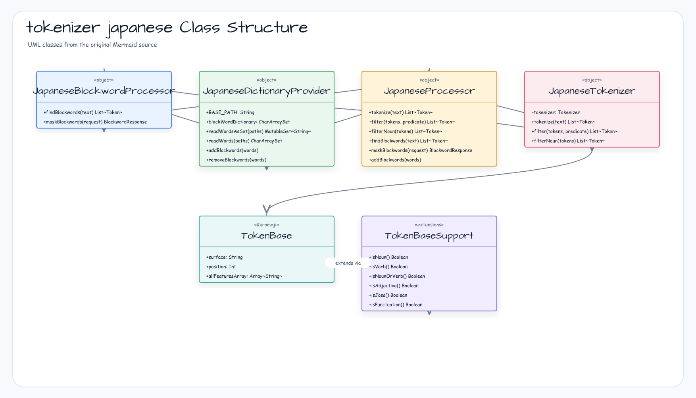

한국어 | [English](./README.md)

# tokenizer-japanese

`tokenizer-core` 위에 구축된 Kuromoji IPAdic 기반 일본어 형태소 분석 및 금칙어 처리 라이브러리입니다.

## 아키텍처



## 주요 기능

- **형태소 분석** — Kuromoji IPAdic 사전을 사용해 일본어 텍스트를 형태소 단위로 분리
- **품사별 필터링** — 내장 `filterNoun` 및 임의 조건식을 받는 범용 `filter` 제공
- **품사 확장 함수** — `TokenBase`에 `isNoun()`, `isVerb()`, `isNounOrVerb()`, `isAdjective()`, `isJosa()`, `isPunctuation()` 추가
- **금칙어 탐지** — 사전에 적재된 `CharArraySet` 기준으로 명사/동사 토큰만 대상으로 검사
- **복합어 금칙어 탐지** — 단일 토큰 매칭 실패 시 인접 명사 + 명사/동사 조합 검사 (예: 覚せい剤 → 覚せい + 剤)
- **금칙어 마스킹** — `Locale.JAPANESE`를 검증하고 LOW/MIDDLE/HIGH cumulative severity threshold를 적용한 뒤 탐지된 토큰을 마스크 문자로 토큰 길이만큼 반복 치환
- **런타임 사전 관리** — 서비스 재시작 없이 금칙어 추가·삭제·초기화 가능
- **suspend 사전 preload** — readiness 전에 `JapaneseProcessor.preload()`로 `japanesetext/block/blocks.txt`와 severity override를 적재하며, 직접 동기 조회는 호환성 fallback으로 유지
- **파사드 패턴** — `JapaneseProcessor`가 하위 컴포넌트 전체를 단일 진입점으로 통합

## 사용법

### 시작 단계 사전 preload

애플리케이션 startup coroutine에서 facade의 preload를 호출하면 첫 금칙어
요청이 요청 스레드에서 사전 I/O를 수행하지 않습니다.

```kotlin
import io.bluetape4k.tokenizer.japanese.JapaneseProcessor

suspend fun warmUpJapaneseTokenizer() {
    JapaneseProcessor.preload()
}
```

### 형태소 분석

```kotlin
import io.bluetape4k.tokenizer.japanese.JapaneseProcessor

val tokens = JapaneseProcessor.tokenize("お寿司が食べたい。")
val surfaces = tokens.map { it.surface }
// [お, 寿司, が, 食べ, たい, 。]
```

### 품사별 필터링

```kotlin
import io.bluetape4k.tokenizer.japanese.JapaneseProcessor
import io.bluetape4k.tokenizer.japanese.tokenizer.isVerb

val tokens = JapaneseProcessor.tokenize("私は、日本語の勉強をしています。")

// 내장 명사 필터
val nouns = JapaneseProcessor.filterNoun(tokens).map { it.surface }
// [私, 日本語, 勉強]

// 커스텀 조건식 — 동사만 추출
val verbs = JapaneseProcessor.filter(tokens) { it.isVerb() }.map { it.surface }
// [し]
```

### 금칙어 탐지 및 마스킹

```kotlin
import io.bluetape4k.tokenizer.japanese.JapaneseProcessor
import io.bluetape4k.tokenizer.model.blockwordOptionsOf
import io.bluetape4k.tokenizer.model.blockwordRequestOf
import io.bluetape4k.tokenizer.model.Severity
import java.util.Locale

// 금칙어 탐지
val found = JapaneseProcessor.findBlockwords("ホモの男性を理解できない").map { it.surface }
// [ホモ]

// 일본어 locale과 severity threshold를 명시해 마스킹
val options = blockwordOptionsOf(locale = Locale.JAPANESE, severity = Severity.MIDDLE)
val request = blockwordRequestOf("ホモの男性を理解できない", options)
val response = JapaneseProcessor.maskBlockwords(request)
println(response.maskedText)        // **の男性を理解できない
println(response.blockwordExists)   // true
println(response.blockWords)        // [ホモ]
```

`maskBlockwords`는 `Locale.JAPANESE`만 허용합니다. severity는 cumulative
threshold로 동작하므로 `LOW`는 모든 tier, `MIDDLE`은 middle/high,
`HIGH`는 high tier만 검사합니다. tier를 생략한 런타임 단어는 `LOW`에 추가됩니다.

### 런타임 사전 관리

```kotlin
import io.bluetape4k.tokenizer.japanese.JapaneseProcessor

// 런타임에 금칙어 추가
JapaneseProcessor.addBlockwords(listOf("東京", "大阪"))
val found = JapaneseProcessor.findBlockwords("これは東京です").map { it.surface }
// [東京]

// 단어 제거
JapaneseProcessor.removeBlockwords(listOf("東京"))

// 인메모리 사전 전체 초기화
JapaneseProcessor.clearBlockwords()
```

## 의존성

| 의존성 | 역할 |
|---|---|
| `tokenizer-core` | 도메인 모델, `DictionaryProvider`, `CharArraySet` |
| `bluetape4k-coroutines` | 비동기 사전 로딩 |
| `kuromoji-ipadic` | Kuromoji IPAdic 형태소 분석기 |

```kotlin
dependencies {
    implementation("io.github.bluetape4k.text:tokenizer-japanese:<current release or snapshot>")
}
```

## 웹 서비스 입력 경계

HTTP boundary에서는 `JapaneseProcessor` 호출 전에 `tokenizeRequestOf`와
`blockwordRequestOf`로 입력을 검증하세요. blank 입력은 `400 Bad Request`,
`MAX_TOKENIZE_TEXT_LENGTH` 또는 `MAX_BLOCKWORD_TEXT_LENGTH`를 초과한 입력은
`413 Payload Too Large`로 매핑하는 것이 좋습니다. 오류 응답에는 status와 길이
metadata만 담고 제출된 텍스트는 포함하지 마세요.

실행 가능한 한국어/일본어 safety sample은
[`../examples/tokenizer-safety-examples`](../examples/tokenizer-safety-examples)를 참고하세요.

> 내부적으로 일본어 형태소 분석을 위해 [Kuromoji IPAdic](https://github.com/atilika/kuromoji)을 사용합니다.
