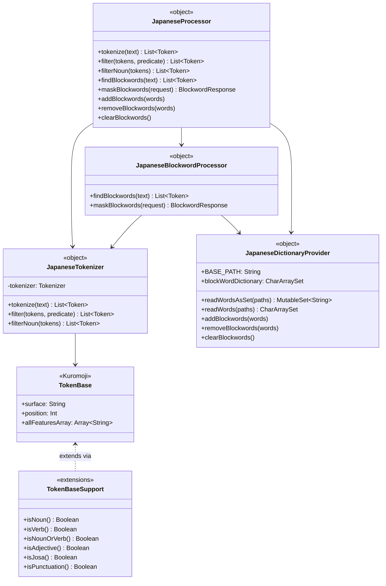

한국어 | [English](./README.md)

# bluetape4k-tokenizer-japanese

`bluetape4k-tokenizer-core` 위에 구축된 Kuromoji IPAdic 기반 일본어 형태소 분석 및 금칙어 처리 라이브러리입니다.

## 아키텍처



## 주요 기능

- **형태소 분석** — Kuromoji IPAdic 사전을 사용해 일본어 텍스트를 형태소 단위로 분리
- **품사별 필터링** — 내장 `filterNoun` 및 임의 조건식을 받는 범용 `filter` 제공
- **품사 확장 함수** — `TokenBase`에 `isNoun()`, `isVerb()`, `isNounOrVerb()`, `isAdjective()`, `isJosa()`, `isPunctuation()` 추가
- **금칙어 탐지** — 사전에 적재된 `CharArraySet` 기준으로 명사/동사 토큰만 대상으로 검사
- **복합어 금칙어 탐지** — 단일 토큰 매칭 실패 시 인접 명사 + 명사/동사 조합 검사 (예: 覚せい剤 → 覚せい + 剤)
- **금칙어 마스킹** — 탐지된 토큰을 마스크 문자로 토큰 길이만큼 반복 치환
- **런타임 사전 관리** — 서비스 재시작 없이 금칙어 추가·삭제·초기화 가능
- **지연 사전 로딩** — `blockWordDictionary`는 최초 접근 시 `runBlocking(Dispatchers.IO)`로 `japanesetext/block/blocks.txt` 적재
- **파사드 패턴** — `JapaneseProcessor`가 하위 컴포넌트 전체를 단일 진입점으로 통합

## 사용법

### 형태소 분석

```kotlin
import io.bluetape4k.tokenizer.japanese.JapaneseProcessor

val tokens = JapaneseProcessor.tokenize("お寿司が食べたい。")
val surfaces = tokens.map { it.surface }
// [お, 寿司, が, 食べ, たい, 。]
```

### 품사별 필터링

```kotlin
import io.bluetape4k.tokenizer.japanese.JapaneseProcessor
import io.bluetape4k.tokenizer.japanese.tokenizer.isVerb

val tokens = JapaneseProcessor.tokenize("私は、日本語の勉強をしています。")

// 내장 명사 필터
val nouns = JapaneseProcessor.filterNoun(tokens).map { it.surface }
// [私, 日本語, 勉強]

// 커스텀 조건식 — 동사만 추출
val verbs = JapaneseProcessor.filter(tokens) { it.isVerb() }.map { it.surface }
// [し]
```

### 금칙어 탐지 및 마스킹

```kotlin
import io.bluetape4k.tokenizer.japanese.JapaneseProcessor
import io.bluetape4k.tokenizer.model.blockwordRequestOf

// 금칙어 탐지
val found = JapaneseProcessor.findBlockwords("ホモの男性を理解できない").map { it.surface }
// [ホモ]

// 기본 옵션(mask = "*")으로 마스킹
val request = blockwordRequestOf("ホモの男性を理解できない")
val response = JapaneseProcessor.maskBlockwords(request)
println(response.maskedText)        // **の男性を理解できない
println(response.blockwordExists)   // true
println(response.blockWords)        // [ホモ]
```

### 런타임 사전 관리

```kotlin
import io.bluetape4k.tokenizer.japanese.JapaneseProcessor

// 런타임에 금칙어 추가
JapaneseProcessor.addBlockwords(listOf("東京", "大阪"))
val found = JapaneseProcessor.findBlockwords("これは東京です").map { it.surface }
// [東京]

// 단어 제거
JapaneseProcessor.removeBlockwords(listOf("東京"))

// 인메모리 사전 전체 초기화
JapaneseProcessor.clearBlockwords()
```

## 의존성

| 의존성 | 역할 |
|---|---|
| `bluetape4k-tokenizer-core` | 도메인 모델, `DictionaryProvider`, `CharArraySet` |
| `bluetape4k-coroutines` | 비동기 사전 로딩 |
| `kuromoji-ipadic` | Kuromoji IPAdic 형태소 분석기 |

```kotlin
dependencies {
    implementation("io.bluetape4k:bluetape4k-tokenizer-japanese:1.7.0-SNAPSHOT")
}
```

> 내부적으로 일본어 형태소 분석을 위해 [Kuromoji IPAdic](https://github.com/atilika/kuromoji)을 사용합니다.
