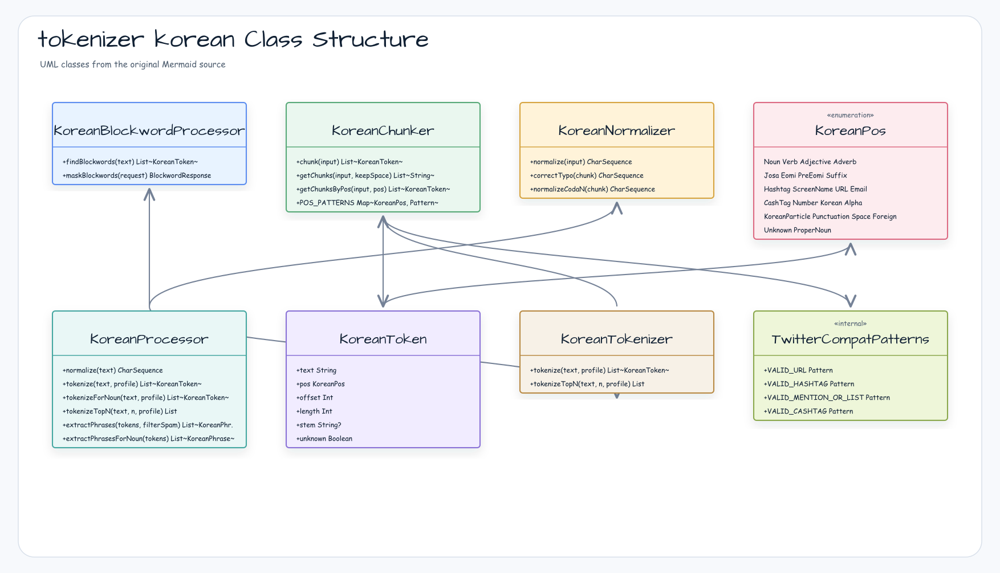

[한국어](./README.ko.md) | English

# tokenizer-korean

Korean NLP library for morphological analysis, normalization, phrase extraction, stemming, sentence splitting, and blockword masking — with no `twitter-text` dependency (URL/Hashtag/Mention/CashTag patterns are implemented internally via `TwitterCompatPatterns.kt`).

## Architecture



## Features

- **Text normalization** — Collapses colloquial repetitions (`ㅋㅋㅋㅋ → ㅋㅋㅋ`), corrects typos (`가쟝 → 가장`), and repairs consonant-coda errors (`버슨가 → 버스인가`)
- **Morphological analysis** — 1-best and top-N morpheme tokenization with 26-class POS tagging
- **Noun-focused tokenizer** — Lightweight tokenization path for phrase extraction
- **Phrase extraction** — Extracts noun phrases from full or noun-focused token streams; supports hashtag phrases
- **Stemming** — Restores verb/adjective to base form (`가느다란 → stem: 갈다`)
- **Sentence splitting** — Splits a text into a `Sequence<Sentence>`
- **Detokenization** — Reconstructs a natural sentence from a token list
- **Blockword masking** — Severity-layered (`LOW`/`MIDDLE`/`HIGH`) dictionary management and `**`-masking
- **Chunking** — Pre-tokenization chunking by POS pattern: URL, Email, Hashtag, ScreenName, CashTag, Number, Korean, Alpha, Punctuation
- **No twitter-text dependency** — URL/Hashtag/Mention/CashTag regex patterns are self-contained in `TwitterCompatPatterns.kt`
- **Runtime dictionary update** — Add nouns or blockwords at runtime without restart
- **Suspend dictionary preload** — Call `KoreanProcessor.preload()` during startup/readiness; direct synchronous access remains a compatibility fallback
- **Thread-safe** — All `KoreanProcessor` methods are safe for concurrent use

## Usage

### Startup dictionary preload

Call the facade preload from an application startup coroutine so the first
dictionary-backed operation does not perform resource I/O on the request thread.

```kotlin
import io.bluetape4k.tokenizer.korean.KoreanProcessor

suspend fun warmUpKoreanTokenizer() {
    KoreanProcessor.preload()
}
```

```kotlin
import io.bluetape4k.tokenizer.korean.KoreanProcessor
import io.bluetape4k.tokenizer.korean.tokenizer.TokenizerProfile
import io.bluetape4k.tokenizer.model.BlockwordRequest
import io.bluetape4k.tokenizer.model.Severity

// 1. Normalize colloquial text
val normalized = KoreanProcessor.normalize("안됔ㅋㅋㅋㅋㅋ")
// → "안돼ㅋㅋㅋ"

// 2. Morphological tokenization
val tokens = KoreanProcessor.tokenize("주말특가 쇼핑몰")
KoreanProcessor.tokensToStrings(tokens)
// ["주말", "특가", "쇼핑몰"]

// 3. Stemming
val stemmed = KoreanProcessor.stem(KoreanProcessor.tokenize("가느다란"))
println(stemmed.first().stem)  // → "갈다"

// 4. Phrase extraction
val phrases = KoreanProcessor.extractPhrases(
    KoreanProcessor.tokenize("성탄절 쇼핑"),
    filterSpam = false
)
phrases.forEach { println(it.text) }

// 5. Sentence splitting
val sentences = KoreanProcessor.splitSentences("안녕? 세상아?").toList()
// size == 2

// 6. Detokenization
val text = KoreanProcessor.detokenize(listOf("뭐", "완벽", "하진", "않", "지만"))
// → "뭐 완벽하진 않지만"

// 7. Runtime noun dictionary extension
KoreanProcessor.addNounsToDictionary("블루테이프4K", "주말특가")

// 8. Blockword masking
KoreanProcessor.addBlockwords(listOf("욕설"), Severity.HIGH)
val response = KoreanProcessor.maskBlockwords(BlockwordRequest("이 욕설은 나쁜 말이야"))
// response.text → "이 **은 나쁜 말이야"

// 9. Top-N tokenization
val topN = KoreanProcessor.tokenizeTopN("대학", n = 2)

// 10. Parallel tokenization with coroutines
runBlocking(Dispatchers.Default) {
    listOf("텍스트1", "텍스트2", "텍스트3").map { text ->
        async { KoreanProcessor.tokenize(text) }
    }.awaitAll()
}
```

## Dependencies

| Dependency | Purpose |
|---|---|
| `tokenizer-core` | `BlockwordRequest`, `Severity`, tokenizer contract interfaces |
| `bluetape4k-coroutines` | Coroutines-based chunker pipeline |
| `bluetape4k-io` | I/O utilities |
| `eclipse-collections` | High-performance collections for dictionary storage |
| `commons-collections4` | Collection utilities |

```kotlin
// build.gradle.kts
implementation("io.github.bluetape4k.text:tokenizer-korean:<current release or snapshot>")
```

## Web-Service Input Boundaries

Use `tokenizeRequestOf` and `blockwordRequestOf` at HTTP boundaries before
calling `KoreanProcessor`. Blank input should map to `400 Bad Request`; text
longer than `MAX_TOKENIZE_TEXT_LENGTH` or `MAX_BLOCKWORD_TEXT_LENGTH` should map
to `413 Payload Too Large`. Error bodies should include only status and length
metadata, not the submitted text.

See [`../examples/tokenizer-safety-examples`](../examples/tokenizer-safety-examples)
for a runnable Korean/Japanese safety sample.
